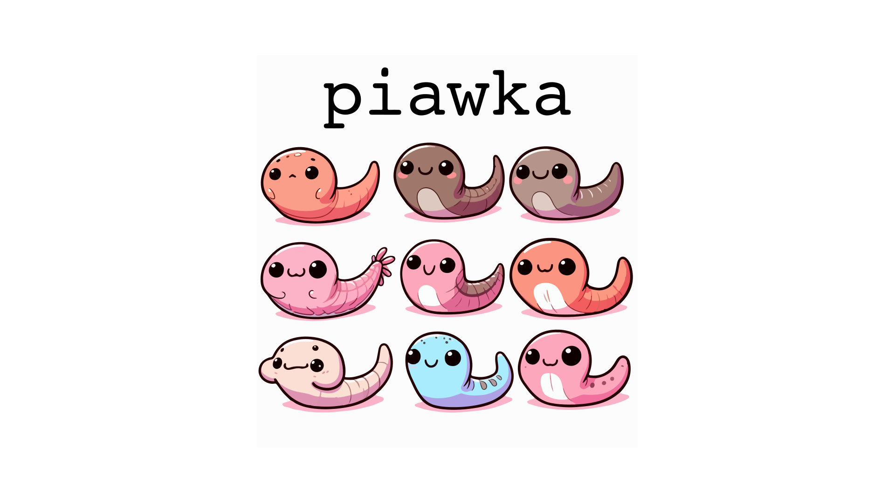

``piawka`` 
==========

The powerful `awk` script to calculate π, Dxy (or πxy, or Nei's D) and Fst in VCF files. Developed to analyze mixed-ploidy groups with substantial amounts of missing data.

   * [Running piawka](#running-piawka)
      * [Installation](#installation)
      * [Usage](#usage)
      * [Input files](#input-files)
      * [Options](#options)
      * [Output](#output)
   * [Example data](#example-data)
      * [Single-threaded execution (pure AWK)](#single-threaded-execution-pure-awk)
      * [Parallel execution (with GNU parallel)](#parallel-execution-with-gnu-parallel)
      * [Advanced example: genewise 4-fold and 0-fold sites' pi and Dxy](#advanced-example-genewise-4-fold-and-0-fold-sites-pi-and-dxy)
   * [Alternatives](#alternatives)
   * [References](#references)
   * [Citing piawka](#citing-piawka)

Largely inspired by [`pixy`](https://github.com/ksamuk/pixy), `piawka`[^1] builds upon it in a few aspects:

[^1]: Pronounced *pi: jaf ka:* after a Russian word meaning "leech".

 - supports **arbitrary ploidy level**, including mixed-ploidy groups
 - supports `pixy`-**weighted and unweighted π and Dxy** calculation
 - can use **multiallelic SNPs**, in biallelic mode also uses multiallelic SNPs that have two alleles in the analyzed groups. Thus, `piawka` might be more suitable for multi-species VCF files with higher share of multiallelic SNPs. 
 - **lightweight and portable**, runs wherever vanilla AWK can run (Windows, macOS, Linux...) and requires no installation
 - **faster on a single core** (and can be parallelized with shell tools, e.g. GNU `parallel` -- see [Usage](#usage))

By default, it reports `pixy`-like π and Dxy:

$$ π_{pixy}, Dxy_{pixy} = { \sum^n N_{diff} \over \sum^n N_{comp} } $$

Where $N_{diff}$ and $N_{comp}$ denote numbers of differences versus comparisons (within-group for π, between groups for Dxy, missing haplotypes excluded) and $n$ stands for the number of sites used for calculation. This means that only one division per VCF file is performed after numerators and denominators from all sites are summarized. This metric gives lower weight to sites with fewer genotyped alleles (i.e. fewer possible comparisons) and should be more robust against missing data.

With option `PIXY=0` `piawka` will calculate **unweighted** (also confusingly called "average weighted") π and Dxy like this:

$$ π_{w}, Dxy_{w} = { { \sum^n { N_{diff} \over N_{comp} } } \over n } $$

This metric might give unpredictable values at sites with lots of missing data, so in this case we deliberately chose to only use sites with >50% alleles genotyped in the current group (the threshold can be changed via the `MIS` option).

## Running `piawka`

### Installation

Just clone the repo (or even simply download the `scripts` folder if you don't need 80Mb example VCF file) and you are good to go!

```bash
git clone https://github.com/novikovalab/piawka.git
cd piawka
```

We recommend the `mawk` AWK interpreter for `piawka` as it's much faster than all alternatives we know. If you don't have it, just change the shebangs to your `awk` distro like

```bash
mawk || sed -i '1s/mawk/awk/' ./scripts/piawka ./scripts/summarize_blks.awk
```

It might be useful to add `piawka` location to `PATH` environmental variable to run it from anywhere by either executing the following code or adding it to your `.bashrc` file:

```bash
echo 'export PATH="/path/to/piawka/scripts:$PATH"' >> ~/.bashrc
```

### Usage

To get help, run `piawka` without any arguments:

```bash
piawka
```

`piawka` works with decompressed VCF files. The easiest way to use it is streaming the VCF file via stdin:

```bash
zcat file.vcf.gz | piawka [OPTIONS] groups_file - > piawka_pi-dxy.tsv
```

If you want to parallelize the counting and have GNU parallel installed, try our wrapper scripts:

```bash
# Parallelize VCF reading and count summary statistics for entire file (a bit less precise)
piawka_par_blk.sh -a parallel_options -g groups_file -p piawka_options -v vcf_gz

# Split VCF by BED regions and count stats for each region in parallel
piawka_par_reg.sh -a parallel_options -b bed_file -g groups_file -p piawka_options -v vcf_gz
```

See [Options](#options) and [Examples](#example-data) for further details.

### Input files

 - a **VCF file**: it is most sensible to include invariant sites for an unbiased estimation of π and Dxy. Consult the well-written [guide](https://pixy.readthedocs.io/en/latest/generating_invar/generating_invar.html) by `pixy` authors. `piawka` only looks at what looks like discrete genotype calls, so any cell can have any imaginable number of genotypes. Regardless of the calculation method, `piawka` does not make assumptions about missing genotype calls and does not include them in the calculation (see why this is good [here](https://pixy.readthedocs.io/en/latest/about.html)). `piawka` parses multiallelic sites but does not parse sites with indels.
 - a **groups file**: this is a 2-column TSV file with no header, first column being the sample IDs from the VCF and the second being the group ID. `piawka` can handle arbitrary number of groups. If a sample from the VCF file is missing in the groups file, it will not be used for calculation. Groups file can also contain non-existent sample IDs, they will not be considered.

### Options

Options are provided as KEY=value pairs (no spaces around the `=` sign!) before input files. Flags can be set to 1 (true) or 0 (false). Following options exist:

 - `DXY=1` (default): output Dxy values along with pi values.
 - `PIXY=1` (default) : use the missingness-based site weighting as in [`pixy`](https://github.com/ksamuk/pixy). Might be better for groups with lots (>10%) of missing data according to [this paper](https://doi.org/10.1111/1755-0998.13707). `piawka` results might be slightly different (and more precise) because here we also make use of sites marked as multiallelic if they have two alleles in a given group. Full convergence with `pixy` can be enforced by filtering out multiallelic sites before running `piawka` (e.g. `bcftools view -M2 file.vcf.gz`), or I can make it an option if there is demand for that.
 - `MULT=1` (experimental) : counts pi and Dxy including multiallelic sites. Default is biallelic sites only. **Note that behavior of multiallelic sites diversity is less well-described, use at own risk!**
 - `PERSITE=1` : returns per-site estimates instead of default VCF-wide average. Note that adding `PIXY=0` will not make any difference in this case.
 - `LOCUS="locus_name"` : the name of the locus in the output. Meaningless with `PERSITE=1`. Default is "chr\_start\_end" (first chromosome encountered in the file is taken).
 - `HET=1` : output heterozygosity, i.e. within-sample pi values. All samples present in the first column of `groups_file` are used, the second column is ignored. Same is running `piawka DXY=0` with single-sample groups but much more efficient. Ignores `DXY=1`.
 - `FST=XXX` or `FST=1` (experimental) : output Fst values for population pairs. Sets `DXY=1`. **Note that Fst behavior is less well-described in presence of missing data!** Therefore, consider comparing results with `PIXY=0` and `PIXY=1`. Following alternatives exist: 
    - `HUD` (default) -- Hudson (1992) after Bhatia et al. (2013);
    - `WC` -- Weir and Cockerham (1984) as interpreted by Bhatia et al. (2013).
 - `MIS=0.5` : maximum share of missing data at a site for a group to be considered. Supposed to be a number between 0 and 1; default 0.5 if `PIXY=0` and 1 otherwise.
 - `VERBOSE=1` : appends numerator, denominator, nGenotypes and nMissing to output as 8th-11th columns respectively. For pi and Dxy with `PIXY=0`, numerator is the sum of metric values across the VCF and denominator = nUsed.

Helper `parallel` scripts (`piawka_par_reg.sh` and `piawka_par_blk.sh`) accept following options:

- `-a parallel_options` : a string of space-separated options for GNU parallel (e.g. `-a "-j20"`)
- `-b bed_file` : the BED file with regions to analyze in parallel jobs.
              If it contains 4+ columns, the 4th is passed as the locus name (LOCUS) to piawka.
 - `-g grp_file` : the groups file for `piawka`.
 - `-p piawka_options` : a string of space-separated options for piawka (e.g. -p "PIXY=1 MULT=1"). *Note that with `piawka_par_reg.sh` the LOCUS value, if provided, will be overridden.* With `piawka_par_blk.sh`, by default `LOCUS` is set to the basename of the VCF file.
 - `-v vcf_gz` : the *compressed* VCF file for `piawka`.

Here are examples of useful `parallel` options to be passed as `-a parallel_options`:

 - `-j 20` : number of parallel jobs (defaults to available CPUs)
 - `--block 10M` : for `piawka_par_blk.sh`, the size of the VCF block for 1 `piawka` job.
 - `--bar` : for `piawka_par_reg.sh`, display progress bar (the share of processed regions) in `stderr`.

Check the [`parallel` tutorial](https://www.gnu.org/software/parallel/parallel_tutorial.html) for more details on GNU `parallel`.

### Output

`piawka` outputs a long-format table with no header and following columns:

 - **locus** : either genomic position of analyzed locus or custom `LOCUS` value.
 - **nSites** : number of "potentially useful" lines in the VCF file (SNPs or invariant sites before filtering for number of alleles (and genotyping rate for weighted pi or dxy))
 - **pop1** : analyzed group 1
 - **pop2** : `.` for pi values or group 2 for Dxy and Fst values
 - **nUsed** : number of sites used for pi calculation (i.e. SNPs and invariant sites; for weighted pi or dxy these should also pass the 50% genotyping rate threshold)
 - **metric** : pi or dxy (or "het" for heterozygosity), average weighted or `pixy`-like
 - **value** of the metric

 If `VERBOSE=1` was supplied, two more columns, **numerator** and **denominator**, are appended.

## Example data

You can try `piawka` with the (part of) genomic variant data we made for Siberian *Arabidopsis lyrata* populations. `alyrata_scaff_1_10000k-10500k.vcf.gz` contains data for diploids and polyploids with various amounts of missing data split into several admixture groups defined in `groups.tsv` file. There are ~0.5M sites and 4 groups.

The following lazy time tests were run on a Lenovo laptop with a 12th gen Core i7 and an SSD (it matters because `piawka` performance is often IO-bound).

Software versions used for testing: `bcftools==1.19`, `parallel==20230822`, `mawk==1.3.4`, `piawka==0.7.5`.

### Single-threaded execution (pure AWK)

In the most simple case, one would calculate summary pi and Dxy for each group and combination of groups for the entire region covered by the VCF file using site-weighted pi like this:

```bash
cd ./examples
vcf=alyrata_scaff_1_10000k-10500k.vcf.gz
grp=groups.tsv
out=piawka.tsv

time zcat $vcf | piawka $grp - > $out
column -t $out
```

The output is:

```
real    0m9.768s
user    0m11.263s
sys     0m0.617s

scaffold_1_9999942_10500000  289790  UKScandinavia_2n  .             289710  pi_pixy   0.00844215
scaffold_1_9999942_10500000  289790  PUWS_4n           .             289614  pi_pixy   0.00893565
scaffold_1_9999942_10500000  289790  CESiberia_2n      .             289676  pi_pixy   0.00749526
scaffold_1_9999942_10500000  289790  LE_2n             .             289658  pi_pixy   0.00746886
scaffold_1_9999942_10500000  289790  PUWS_4n           CESiberia_2n  289475  dxy_pixy  0.00954623
scaffold_1_9999942_10500000  289790  UKScandinavia_2n  CESiberia_2n  289507  dxy_pixy  0.0127503
scaffold_1_9999942_10500000  289790  UKScandinavia_2n  PUWS_4n       289448  dxy_pixy  0.0124935
scaffold_1_9999942_10500000  289790  LE_2n             CESiberia_2n  289518  dxy_pixy  0.00882309
scaffold_1_9999942_10500000  289790  UKScandinavia_2n  LE_2n         289495  dxy_pixy  0.0125041
scaffold_1_9999942_10500000  289790  PUWS_4n           LE_2n         289464  dxy_pixy  0.00930029
```

### Parallel execution (with GNU `parallel`)

Now, let's test the parallel VCF reading:

```bash
vcf=alyrata_scaff_1_10000k-10500k.vcf.gz
grp=groups.tsv
out2=piawka_blks.tsv

time piawka_par_blk.sh -a "-j20 --block 10M" -g $grp -v $vcf > $out2

#real    0m3.552s
#user    0m17.537s
#sys     0m4.275s
```

The speed up is bigger with real-world huge files but is obvious here as well.

The output is the same, though lines may be shuffled. With `PIXY=0` averaging gets imprecise because `nUsed`-weighted mean of per-block statistics is taken. By default, first column is set to the name of the analyzed file.

A common usecase is running `piawka` for a set of genomic regions (genes or windows). Having a BED file with these regions (like example `genes.bed`) at hand and helper tools like `bcftools` GNU `parallel` installed, this can be parallelized like:

```bash
vcf=alyrata_scaff_1_10000k-10500k.vcf.gz
grp=groups.tsv
bed=genes.bed
out3=piawka_genes.tsv

time piawka_par_reg.sh -a "-j20" -b $bed -g $grp -v $vcf > $out3

head -5 $out3 | column -t
```

Parallel reading works even better with a BED file because tabix indexing is put to use; the test dataset is too small to show it in a convincing way though. And we get stats for all of the genes in under three seconds:

```
real    0m2.921s
user    0m18.361s
sys     0m14.211s

AL5G20950  107  UKScandinavia_2n  .             107  pi_pixy   0.00589623
AL5G20950  107  PUWS_4n           .             107  pi_pixy   0.00366512
AL5G20950  107  CESiberia_2n      .             106  pi_pixy   0.00764818
AL5G20950  107  LE_2n             .             107  pi_pixy   0.0112503
AL5G20950  107  PUWS_4n           CESiberia_2n  106  dxy_pixy  0.00548654
. . .
```

### Advanced example: genewise 4-fold and 0-fold sites' pi and Dxy

One can limit calculations to synonymous/non-synonymous sites inferred using an external tool. Example below was made with [`degenotate`](https://github.com/harvardinformatics/degenotate). At preparation step, `degeneracy-all-sites.bed` is made using `degenotate` with annotation file and reference genome sequence[^2]. Then following steps are needed to extract 0-folds and 4-folds and calculate genewise pi and dxy from them:

[^2]: I was using [`liftoff`](https://github.com/agshumate/Liftoff) annotation that lacks phase info so I had to sanitize it first with `agat_sp_fix_cds_phase.pl` from [AGAT toolkit](https://github.com/NBISweden/AGAT). Details [here](https://github.com/harvardinformatics/degenotate/issues/32).

```bash
cd examples/degenotate
vcf=../alyrata_scaff_1_10000k-10500k.vcf.gz
grp=../groups.tsv

# Extract 0fold and 4fold BED lines, remove position info attached to gene name by degenotate
awk -v OFS="\t" '$5==0 { sub(/:[0-9]+$/, "", $4); print $0 }' degeneracy-all-sites.bed > zerofolds.bed
awk -v OFS="\t" '$5==4 { sub(/:[0-9]+$/, "", $4); print $0 }' degeneracy-all-sites.bed > fourfolds.bed

# Get arrays of gene names encountered in BED files
zerogenes=( $( cut -f4 zerofolds.bed | sort | uniq ) )
fourgenes=( $( cut -f4 fourfolds.bed | sort | uniq ) )

# Get gene by mRNA BED, extract needed sites and feed to piawka, name loci as genes
# Make sure `grep -w gene_name` does always filter out one gene in your case too
# Then two commands below take ~3 sec each
parallel -j20 \
  bcftools view -R \<\( grep -w {} ../mRNA.bed \) -T \<\( grep -w {} zerofolds.bed \| cut -f1,3 \) $vcf \| \
  piawka LOCUS={} $grp - > piawka_zerofolds.tsv ::: ${zerogenes[@]} 

parallel -j20 \
  bcftools view -R \<\( grep -w {} ../mRNA.bed \) -T \<\( grep -w {} fourfolds.bed \| cut -f1,3 \) $vcf \| \
  piawka LOCUS={} $grp - > piawka_fourfolds.tsv ::: ${fourgenes[@]}
```

Note that we sliced the VCF using both big (-R) "regions" and small (-T) "targets". This method turns out to speed up data extraction 100-fold! We benefit a lot from this dark magic because IO is our main bottleneck. Without regions (or using targets  as regions) handling BED files with many small regions gets very slow.

## Alternatives

This script shows all strong and weak points of being written in a simple text-processing language of `awk`. While combining high speed with not too complicated code, it lacks good error handling. It means that with corrupted inputs the script will do its best to produce *some* result silently. If you would like a more verbose solution, consider some better-developed alternatives.

For diploid VCFs, one can use [`pixy`](https://github.com/ksamuk/pixy). To make it work with polyploids, one would need to randomly sample two GT values from each cell with >2 genotypes (it should not affect diversity metrics much at the genomic scale).

For 2-, 4-, 6- and 8-ploids (however, without mixed-ploidy populations) there is a set of C scripts called [`polySV`](https://github.com/thamala/polySV) that does its job good and quick. However, it employs hard-filtering of missing data based on % of genotyped samples, which results in less data being used.

For arbitrary ploidy levels that might be arbitrarily mixed there is an R package called [`StAMPP`](https://cran.r-project.org/web/packages/stampp/index.html). Its heavy-lifting functions are written in C, but that's still an R package.

## References

The `pixy` method of dealing with missing data for π calculation was introduced in [this paper](https://doi.org/10.1111/1755-0998.13326). You can find discussion on the applicability of the `pixy` metric [here](https://doi.org/10.1111/1755-0998.13707) and [here](https://doi.org/10.1111/1755-0998.13738). 

Our choice of Hudson's Fst estimator (and the way of summarizing it over sites) is influenced by [this paper](http://dx.doi.org/10.1101/gr.154831.113) whose authors argue that it is least burdened with assumptions and least biased with variable sample sizes. Usage of Fst estimation for multiple alleles is advocated by Weir and Cockerham [here](http://dx.doi.org/10.2307/2408641).

We suggest to parallelize `piawka` using GNU `parallel` which is introduced [here](https://doi.org/10.5281/zenodo.1146014).

## Citing `piawka`

If you want to express your gratitude for `piawka`, please cite our [Siberian *Arabidopsis* paper]() (coming soon!) where we have introduced and first used it.

