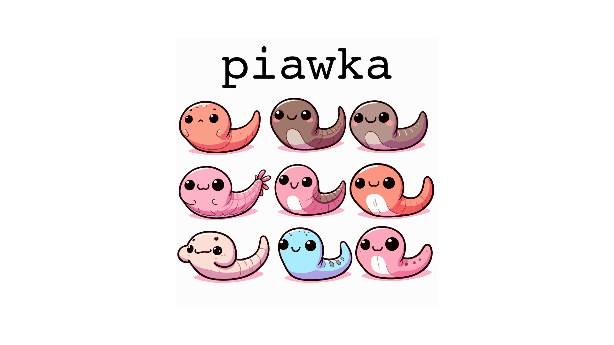

``piawka`` 
==========

[](http://bioconda.github.io/recipes/piawka/README.html)

Calculate SNP-based population statistics over groups of samples in VCF files with:

- indexable BED output
- correct handling of missing data
- support for polyploid variant calls
- higher data yield due to per-group ALT-agnostic SNP retrieval
- a broad selection of statistics, extensible with modules
- convenient helper tools for making genomic windows, filtering and summarizing the results
- the power of GNU AWK: no installation, competitive speed, low memory footprint, and multiprocessing :eyes:

> [!WARNING]
> `piawka` is under development. At this stage, breaking changes are not unthinkable of. If something does not seem to work well, check newer versions and do not hesitate to file an issue!

# Installation

```bash
conda install -c bioconda piawka
```

Alternatively, have the following programs available in the command line and clone the repo:

 - `gawk>=v5.2.0`
 - `tabix`
 - `bgzip`

```bash
git clone https://github.com/novikovalab/piawka.git
export PATH="$( realpath ./piawka ):${PATH}"
```

# Usage

Docs are available at <https://novikovalab.github.io/piawka>.

## Input and output

Mandatory (for `piawka calc`):

- **VCF file** -- bgzipped and tabixed

Optional:

- **groups file** -- 2-column TSV with sample ID and group ID (may include relevant samples only)
- **regions/targets file** -- BED file to restrict/split output by regions

Output is a BED file:

```console
$ cd piawka/examples
$ piawka calc -v alyrata_scaff_1_10000k-10500k.vcf.gz -b genes.bed -g groups.tsv -s pi,dxy
#chr        start     end       locus      pop1              pop2              stat    value        numerator  denominator
scaffold_1  10035093  10035276  AL5G20950  CESiberia_2n      LE_2n             dxy     0.0071137    460        64664
scaffold_1  10035093  10035276  AL5G20950  PUWS_4n           .                 pi      0.00588993   640        108660
scaffold_1  10035093  10035276  AL5G20950  LE_2n             PUWS_4n           dxy     0.00881262   1102       125048
scaffold_1  10035093  10035276  AL5G20950  LE_2n             .                 pi      0.00772461   1078       139554
...
```

## Subcommands

- `piawka calc`: calculate various population statistics from a VCF file
- `piawka dist`: convert calc output to PHYLIP or NEXUS distance matrix
- `piawka filt`: filter piawka output using AWK expressions
- `piawka list`: show all statistics available for calculation
- `piawka sum`: summarize stats from calc output across regions
- `piawka win`: prepare genomic windows from various sources

## Statistics

Within groups:

- `lines`: number of lines used in calculation
- `miss`: share of missing genotype calls
- `pi`: expected heterozygosity = nucleotide diversity
- `maf`: minor allele frequency
- `daf`: alternative ("derived") allele frequency
- `tajima`: Tajima's D
- `tajimalike`: Tajima's D interpolated for missing genotypes (experimental)
- `theta_w`: Watterson's theta
- `theta_low`: Theta estimator based on sites with 0<allele_freq<0.33
- `theta_mid`: Theta estimator based on sites with 0.33<=allele_freq<0.66
- `theta_high`: Theta estimator based on sites with 0.33<=allele_freq<0.66

Between groups (pairwise): 

- `afd`: average allele frequency difference
- `dxy`: absolute nucleotide divergence
- `fst`: fixation index, Hudson's estimator
- `fstwc`: fixation index, Weir & Cockerham's estimator
- `rho`: Ronfort's rho
- `nei`: Nei's D standard genetic distance

# Citation

First mention of `piawka` as well as the test data are coming from <https://doi.org/10.1093/molbev/msaf153>.
